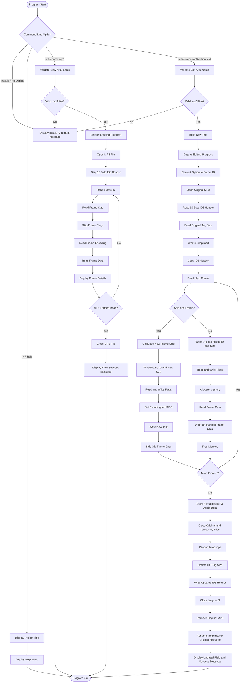

# 🎵 MP3 Tag Reader and Editor

## 📖 Overview

The **MP3 Tag Reader and Editor** is a command-line based C project that allows users to read and edit important metadata stored inside an MP3 audio file.

The application works with ID3 tag frames and provides three main operations:

1. **View MP3 file details**
2. **Edit MP3 file details**
3. **Display Help**

The project supports reading and editing the following MP3 metadata fields:

- **Title**
- **Artist**
- **Album**
- **Year**
- **Genre**
- **Comment**

The program reads the MP3 file in binary mode, processes the ID3 header and tag frames, displays the selected metadata, and can create an updated MP3 file while preserving the remaining audio data.

## 🎯 Why This Project?

MP3 files contain metadata that describes the audio track. Managing this information at the binary-file level provides practical experience with:

- Command-line arguments
- Structures of binary file formats
- File handling
- Reading and writing binary data
- ID3 tag frames
- Frame IDs and frame sizes
- Bitwise operations
- Dynamic memory allocation
- String handling
- Temporary files
- File replacement using `remove()` and `rename()`
- Modular programming in C

## 🛠️ Technologies Used

| Technology / Concept | Usage |
|---|---|
| **C** | Core programming language |
| **Command-Line Arguments** | Accepts view, edit, help, file name and metadata values |
| **Binary File I/O** | Reads and writes MP3 data using `fopen()`, `fread()`, `fwrite()`, `fseek()`, `fclose()` |
| **String Handling** | `strcmp()`, `strlen()`, `strcpy()` |
| **Dynamic Memory** | `malloc()` and `free()` for edit text and frame data |
| **Bitwise Operations** | Converts ID3 header and frame-size bytes into integer values |
| **ID3 Frames** | Reads and updates metadata frames |
| **Temporary File Handling** | Uses `temp.mp3` while editing |
| **File Operations** | `remove()` and `rename()` replace the original MP3 |
| **ANSI Escape Codes** | Provides colored and formatted terminal output |
| **Modular Programming** | Separates main, menu, view, edit and header functionality |

The source files use standard C headers such as `stdio.h`, `string.h`, and `stdlib.h`.

## 🏗️ System Architecture

```text
                         +----------------------+
                         |       main.c         |
                         | Command-Line Input   |
                         | Argument Validation  |
                         | View / Edit / Help   |
                         +----------+-----------+
                                    |
              +---------------------+---------------------+
              |                     |                     |
              v                     v                     v
       +-------------+       +-------------+       +-------------+
       |   -v View   |       |   -e Edit   |       | -h / -help |
       +------+------+       +------+------+       +------+------+
              |                     |                     |
              v                     v                     v
       +-------------+       +-------------+       +-------------+
       |   view.c    |       |   edit.c    |       |   menu.c    |
       | Read MP3    |       | Edit MP3    |       | Title / UI  |
       | Read Frames |       | Replace Tag |       | Help Menu   |
       +------+------+       +------+------+       +-------------+
              |                     |
              |                     |
              v                     v
       +-------------+       +----------------------+
       | ID3 Frames  |       |    temp.mp3         |
       |             |       | Temporary MP3 File  |
       | TIT2        |       +----------+-----------+
       | TPE1        |                  |
       | TALB        |                  v
       | TYER        |       +----------------------+
       | TCON        |       | Updated MP3 File     |
       | COMM        |       | Header + Frames +    |
       +-------------+       | Audio Data           |
                             +----------------------+
                                     
                         +----------------------+
                         |       mp3.h          |
                         | Function Prototypes  |
                         | ANSI Color Macros    |
                         +----------------------+
```

## 🔄 Program Flow



## 📂 Project Structure

```text
MP3-Tag-Reader-and-Editor/
│
├── README.md
├── main.c
├── menu.c
├── view.c
├── edit.c
├── mp3.h
│
└── screenshots/
    ├── help-menu.png
    ├── view-details.png
    ├── edit-title.png
    ├── edit-artist.png
    ├── edit-album.png
    ├── edit-year.png
    ├── edit-genre.png
    └── edit-comment.png
```

> Add or rename the files inside `screenshots/` according to the actual screenshot names in your project folder.

## 🔑 Key Functions

### 🆘 Help Menu

The help operation displays the available commands and their usage.

```bash
./a.out -h
```

or

```bash
./a.out -help
```

The help menu provides the main operations and all supported edit options.

### 👁️ View MP3 Details

MP3 metadata can be viewed using:

```bash
./a.out -v filename.mp3
```

The program:

1. Opens the MP3 file in binary read mode.
2. Skips the 10-byte ID3 header.
3. Reads six ID3 frames.
4. Reads each frame ID.
5. Reads the frame size.
6. Skips the frame flags.
7. Reads the encoding byte.
8. Reads the frame data.
9. Displays the corresponding metadata field.

The view implementation processes six frames and maps `TIT2`, `TPE1`, `TALB`, `TYER`, `TCON`, and `COMM` to the displayed fields.

### ✏️ Edit MP3 Details

The edit command follows this format:

```bash
./a.out -e filename.mp3 -t changing_text
```

Supported edit options are:

| Option | Frame ID | Field |
|---|---|---|
| `-t` | `TIT2` | Title |
| `-A` | `TPE1` | Artist |
| `-a` | `TALB` | Album |
| `-y` | `TYER` | Year |
| `-c` | `TCON` | Genre |
| `-C` | `COMM` | Comment |

These option-to-frame mappings are implemented directly in `edit.c`.

Example:

```bash
./a.out -e AudioFile.mp3 -t My New Song
```

The program combines command-line words after the edit option into one text string before passing it to the editing function.

### 🔄 MP3 Editing Process

During editing, the program:

1. Opens the original MP3 file.
2. Reads the 10-byte ID3 header.
3. Reads the existing tag size.
4. Creates a temporary file named `temp.mp3`.
5. Copies the ID3 header.
6. Processes the six metadata frames.
7. Replaces the selected frame with the new text.
8. Copies unchanged frames.
9. Copies the remaining MP3 audio data.
10. Updates the ID3 tag size.
11. Removes the original file.
12. Renames `temp.mp3` to the original filename.

The implementation explicitly copies the remaining MP3 audio data after processing the metadata frames.

The original file is replaced only after the temporary file has been created and processed successfully.

## 🧩 ID3 Frame Handling

An MP3 metadata frame contains information such as:

```text
+----------------+
|   Frame ID     |  4 bytes
+----------------+
|   Frame Size   |  4 bytes
+----------------+
|   Frame Flags  |  2 bytes
+----------------+
|   Encoding     |  1 byte
+----------------+
|   Frame Data   | Variable
+----------------+
```

The project provides separate functions for reading:

- Frame ID
- Frame size
- Frame encoding
- Frame data

These functions are declared in `mp3.h`.

### 🔢 Frame ID

The frame ID is read as four bytes and terminated with `'\0'` so it can be handled as a C string.

### 📏 Frame Size

The four frame-size bytes are combined using bitwise shift and OR operations to obtain the frame size as an integer.

### 🔤 Frame Data

The first byte of the frame is treated as the encoding byte. The remaining frame data is then read and terminated with `'\0'` for display.

## ✅ Command-Line Validation

The program validates the command-line operation before processing the MP3 file.

### 👁️ View

View requires:

```bash
./a.out -v filename.mp3
```

The program checks that the required number of arguments is provided and that the filename ends with `.mp3`.

### ✏️ Edit

Edit requires at least:

```bash
./a.out -e filename.mp3 option changing_text
```

The program checks the argument count and `.mp3` file extension before creating the new text and starting the edit operation.

### ❌ Invalid Arguments

Invalid commands display the usage information for view, edit, and help operations.

## 💾 File Handling

The project uses binary file handling because MP3 files contain binary audio and metadata data.

### 📥 Reading

```text
MP3 File
   |
   v
fopen(..., "rb")
   |
   v
Read ID3 Header
   |
   v
Read Frames
   |
   v
Display Metadata
```

The view operation opens the file using binary read mode and processes the metadata frame-by-frame.

### 💾 Editing

```text
Original MP3
     |
     v
Read Header + Frames
     |
     v
Create temp.mp3
     |
     +----> Replace Selected Frame
     |
     +----> Copy Unchanged Frames
     |
     +----> Copy Remaining Audio Data
     |
     v
Update Tag Size
     |
     v
Remove Original MP3
     |
     v
Rename temp.mp3
     |
     v
Updated MP3
```

The editing implementation copies the remaining audio data from the original file into the temporary file before replacing the original file.

## 🚀 How to Run

### 🔧 Compile

```bash
gcc main.c menu.c view.c edit.c -o mp3tag
```

### ▶️ Run

#### 🆘 Help

```bash
./mp3tag -h
```

or

```bash
./mp3tag -help
```

#### 👁️ View MP3 Details

```bash
./mp3tag -v AudioFile.mp3
```

#### ✏️ Edit Title

```bash
./mp3tag -e AudioFile.mp3 -t My New Song
```

#### ✏️ Edit Artist

```bash
./mp3tag -e AudioFile.mp3 -A New Artist
```

#### ✏️ Edit Album

```bash
./mp3tag -e AudioFile.mp3 -a New Album
```

#### ✏️ Edit Year

```bash
./mp3tag -e AudioFile.mp3 -y 2026
```

#### ✏️ Edit Genre

```bash
./mp3tag -e AudioFile.mp3 -c Rock
```

#### ✏️ Edit Comment

```bash
./mp3tag -e AudioFile.mp3 -C New Comment
```

## 📚 Learnings & Outcomes

- Improved understanding of C command-line arguments using `argc` and `argv`.
- Learned how to work with MP3 files in binary mode.
- Learned the basic structure of ID3 metadata frames.
- Practiced reading fixed-size binary fields using `fread()`.
- Learned to use `fseek()` for navigating through binary file data.
- Improved understanding of bitwise shift and OR operations.
- Practiced dynamic memory allocation using `malloc()` and `free()`.
- Learned how to create and process temporary files.
- Implemented metadata editing while copying the remaining MP3 audio data.
- Improved modular programming by separating functionality into multiple source files.
- Strengthened debugging and file-handling skills.
- Learned how command-line tools can be designed using C.

## ⭐ Project Summary

> **MP3 Tag Reader and Editor** is a command-line based C application that reads and edits MP3 metadata such as title, artist, album, year, genre, and comment. It demonstrates binary file handling, ID3 frame processing, command-line arguments, bitwise operations, dynamic memory allocation, and temporary-file based MP3 editing.

## 👨‍💻 Author

**Naveenkumar Kammar**
